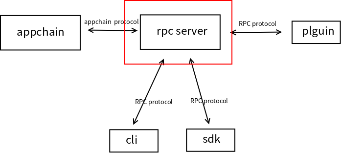

# Pier Client Sawooth

This is sawtooth's pier-plugins of bitxhub implemented based on v1.4's bitxhub-pier-plugins and sawtooth's api. I also use RPC to decompose client from plugin completely, client and plugin can communicate by RPC protocol rather than rely on each other physically. So in theory, only if you implemented a RPC server that can write to or read data from appchain. Any appchain can be linked to bitxhub network. It will be easier to develop a cross-chain demo now. However there still some problem now. I may talk about them latter in this doc.

I only implemented data_swapper function of chaincode now, which can fetch data from one chain to another chain.

If you have any question, please contact me via zekdot@163.com

## How to build sawtooth related network

### Start sawtooth network and transaction family

You can read this official doc for more detail. I use Ubuntu way to build a single node for experiment. [Using Ubuntu for a Single Sawtooth Node](https://sawtooth.hyperledger.org/docs/1.2/app_developers_guide/installing_sawtooth.html#using-ubuntu-for-a-single-sawtooth-node)

After start of network, we need to deploy our own Family Transaction now. It's in `examples/broker`. Copy it to your workspace. Then execute following command to build  executable program.

```sh
cd broker
go mod tidy
go mod vendor
go build
```

Then you can see a executable file `broker`

Use following command to connect this family transaction to sawtooth network.

```sh
./broker --connect tcp://localhost:4004
```

Now whole sawtooth network is ready.

### Start RPC server

Next will be RPC server in `broker_service`. Copy it to your workspace.  Then execute following command to run.

```sh
cd broker_service
go run *.go
```

Now whole network is ready.

### Compile client

Before we start to use it. We need to compile our client. We will use it to operate network manually when we want to send some request or set data.

Copy `broker_client` to your workspace. Then run following command to compile.

```sh
cd broker_client
go build
```

Now there will be a executable program `broker_client` in the dir.

Run this to initialize meta data of broker contract, then we can run pier successfully latter.

```sh
./broker_client init
```

### Start pier

Before start, make sure `pier` command is ready.

```sh
git clone https://github.com/meshplus/pier
git checkout v1.0.0-rc1
cd pier
make install
```

If run `pier` and get prompt, `pier` is ready.

```sh
zekdot@172-19-240-22:~/bitxhub$ pier
NAME:
   Pier - Manipulate the crosschain node

USAGE:
   pier [global options] command [command options] [arguments...]

VERSION:
   0.0.0
```

Copy  all file in `script` to your workspace.

Modify `prepare_sawtooth_pier` 's parameter to accommodate to your situation.

* WORKSPACE It's where you work, you should also put this script here.
* PIER_CLIENT_PATH It's our project's path
* REMOTE_BITXHUB_PATH bitxhub url that deploy relay-chain
* REMOTE_IP relay-chain's server ip

Run `bash prepare_sawtooth_pier.sh`

```sh
GO111MODULE=on go build --buildmode=plugin -o build/sawtooth.so ./*.go
genesis.json                                  100%  223   650.3KB/s   00:00    
"0xf2d66e2c27e93ff083ee3999acb678a36bb349bb"
appchain register successfully, id is 0x474921e13b435f641e4c952fef86b847ee9136a8
Deploy rule to bitxhub successfully
pier is ready, address is 0x474921e13b435f641e4c952fef86b847ee9136a8, you need to save this value for send cross-chain request
run following code to start pier
pier --repo=/home/hzh/.pier start
```

According the output, pier address is `0x474921e13b435f641e4c952fef86b847ee9136a8`, run following code to start pier.

```sh
pier --repo=/home/hzh/.pier start
```

When seeing this. pier is ready:

```
29 module=syncer
INFO[06:30:10.840] Persist interchain tx wrapper                 count=0 height=30 module=syncer
INFO[06:30:10.840] Persist interchain tx wrapper                 count=0 height=31 module=syncer
INFO[06:30:10.840] Persist interchain tx wrapper                 count=0 height=32 module=syncer
INFO[06:30:10.840] Syncer started                                bitxhub_height=32 current_height=32 module=syncer
INFO[06:30:10.840] Exchanger started                             module=exchanger
```

Relay-chain will also give some prompt:

```
INFO[06:30:10.543] Persist block                                 count=1 hash=edb393...2b1abf height=32 module=executor
INFO[06:30:10.835] Add pier                                      id=0x2cb98405fedc08b4eead5ac697d34186818d765b module=router
```

Now whole network is ready.

## How to use

### Prepare data

We set value1 to key1 on sawtooth chain. And set value2 to key2 on fabric chain. Use client we compile before to set data on sawtooth:

```sh
./broker-client set key1 value1
```

Now assume we want to fetch key2's value on fabric chain and it's pier id is `0x54100029b40d9fd42eb64674867fec76af82824a`.

Use this command to call a cross-chain request:

```sh
./broker-client get 0x54100029b40d9fd42eb64674867fec76af82824a mychannel\&data_swapper key2
```

Wait about ten seconds. Use following command to check whether we can get value now:

```sh
hzh@hzh:~/sawtooth/broker_client$ ./broker_client get key2
key2 :  value2
```

As show in output. We have get data from fabric chain.

## How to join other appchain type

As I said. You can join any appchain to your network because in current architecture. Plugin is not so rely on appchain because we assign communication task to broker service. So you can use any language support RPC call to develop your RPC server as show in red box of following figure. And other component don't need to be replaced or modified.



### Implement RPC server

You can use any language you prefer. Only need to make sure it support RPC. Here we take Go language client of fabric2 and Python language client of sawtooth as example to show it's effect.

